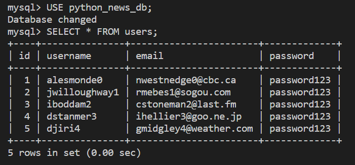

# Create a User Model

The first table that we want to create for Just Tech News is the `users` table, but we'll let SQLAlchemy run the `CREATE TABLE` command based on the model.

When using SQLAlchemy, we create models as Python classes.

## Examples of Python Classes

For an example of a Python class, refer to the following code:

```python
# define the class
class Animal:
  def __init__(self, name):
    self.name = name

  def sleep(self):
    print(self.name + ' is sleeping')

# create a new object
cat = Animal('Kitty')
cat.sleep()
```

The syntax might seem confusing at first, but notice the similarities to JavaScript classes. For example, `self` is equivalent to `this`, and `__init__()` is equivalent to `constructor()`.

Python classes can also inherit from other classes, as shown in the following example:

```python
class Cat(Animal):
  def meow(self):
    print(self.name + ' says "meow"')

cat = Cat('Kitty')
cat.meow()
cat.sleep()
```

In this example, the `Cat` class inherits the `name` property and the `sleep()` method from `Animal` and then adds its own `meow()` method.

>Rewind
>
> In JavaScript, you'd create these two classes as follows:

```python
class Animal {
 constructor(name) {
   this.name = name;
 }

 sleep() {
   console.log(this.name + ' is sleeping');
 }
}

class Cat extends Animal {
 meow() {
   console.log(this.name + ' says "meow"');
 }
}

const cat = new Cat('Kitty');
cat.meow();
cat.sleep();
```

## Create the User Class

Let's implement this using the data models. In the `app` directory, create a new directory called `models`. In the `app/models` directory, create the following files:

* `__init__.py`

* `User.py`

In `User.py`, add the following code:

from app.db import Base
from sqlalchemy import Column, Integer, String

```python
class User(Base):
  __tablename__ = 'users'
  id = Column(Integer, primary_key=True)
  username = Column(String(50), nullable=False)
  email = Column(String(50), nullable=False, unique=True)
  password = Column(String(100), nullable=False)
```

We just created a `User` class that inherits from the `Base` class. Remember that earlier, we created `Base` as part of the `db` package. In the `User` class, we declare several properties that the parent `Base` class will use to make the table. We use classes from the `sqlalchemy` module to define the table columns and their data types. We can also give options to each column, like `nullable=False`, which will become a SQL `NOT NULL`.

## Sync the User Model with the Database

Let's confirm that by syncing this model with the database. First, in the `models/__init__.py` file, add the following `import` statement:

```python
from .User import User
```

>Hide Pro Tip
>
>Consolidating your modules in the `__init__.py` file of the parent package makes it easier to later import them into other modules.

## Create and Populate the User Table

In the root directory of your project, create a new file called `seeds.py`. In the `seeds.py` file, add the following code:

```python
from app.models import User
from app.db import Session, Base, engine

# drop and rebuild tables
Base.metadata.drop_all(engine)
Base.metadata.create_all(engine)
```

This is where the `db` variables that you created earlier come into play. The code uses the `Base` class together with the `engine` connection variable to do two things. First, it drops all the existing tables. Second, it creates any tables that `Base` mapped, in a class that inherits `Base` (like `User`).

Use the following command to run the script:

```console
python seeds.py
```

or 

```console
python3 seeds.py
```

Review the information that prints to the command-line window. It should resemble the following example:

```console
CREATE TABLE users (
  id INTEGER NOT NULL AUTO_INCREMENT,
  username VARCHAR(50) NOT NULL,
  email VARCHAR(50) NOT NULL,
  password VARCHAR(100) NOT NULL,
  PRIMARY KEY (id),
  UNIQUE (email)
)
```

This is the SQL statement that SQLAlchemy ran for us. Now that we have a table, let's fill it with data.

Add the following code to the end of the `seeds.py` file:

```python
db = Session()

# insert users
db.add_all([
  User(username='alesmonde0', email='nwestnedge0@cbc.ca', password='password123'),
  User(username='jwilloughway1', email='rmebes1@sogou.com', password='password123'),
  User(username='iboddam2', email='cstoneman2@last.fm', password='password123'),
  User(username='dstanmer3', email='ihellier3@goo.ne.jp', password='password123'),
  User(username='djiri4', email='gmidgley4@weather.com', password='password123')
])

db.commit()

db.close()
```

Anytime we want to perform a CRUD operation using SQLAlchemy, we need to establish a temporary session connection with the `Session` class. Within this `db` session object, we use the `add_all()` method and the `User` model to create several new users.

Note that `db.add_all()` alone doesn't change the database. In fact, it only preps the SQL queries. To run the `INSERT` statements, you need to call `db.commit()`. If you don't need to make any other database transactions at this time, you can close the session connection by calling `db.close()`.

Run the script again using the command `python seeds.py` or `python3 seeds.py`, and note the output. The command line should print something like the following:

```console
2020-08-07 11:24:57,709 INFO sqlalchemy.engine.base.Engine INSERT INTO users (username, email, password) VALUES (%(username)s, %(email)s, %(password)s)
2020-08-07 11:24:57,710 INFO sqlalchemy.engine.base.Engine {'username': 'alesmonde0', 'email': 'nwestnedge0@cbc.ca', 'password': 'password123'}
```

Note that SQLAlchemy ran several `INSERT` statements that coincided with the `User` objects in the script.

To verify that the insertions worked, open the MySQL shell. First, run `USE python_news_db;` to choose the python news database, then run a `SELECT * FROM users;` statement. In return, you should get a table that resembles the following image:



`The command line displays a user table with id, username, email, and password fields.`

Okay, we've finished the `users` table! However, we should implement extra validations to protect this data. We'll expand on the `User` model to do this.

---
© 2024 edX Boot Camps LLC. Confidential and Proprietary. All Rights Reserved.
