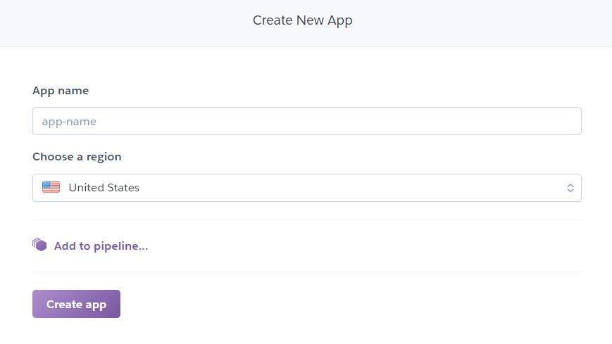
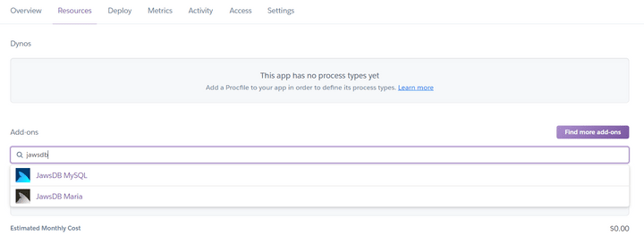
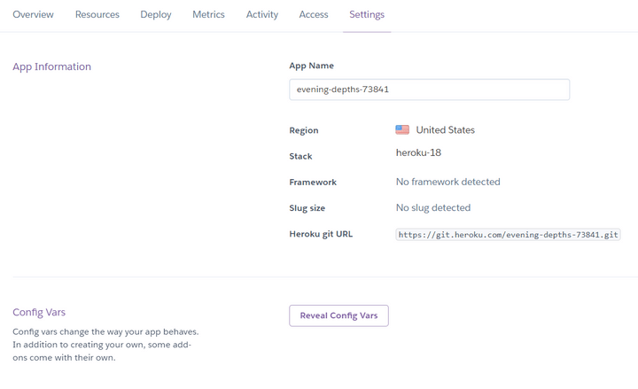

# Set Up the Heroku App

In your browser, log in to the Heroku website, then navigate to the [Create New App page](https://dashboard.heroku.com/new-app). It should look like the following image:



`The Create New App page in Heroku.`

Enter a unique app name and click the "Create app" button.

Because Just Tech News uses a database, you need to provision a MySQL add-on. In the Heroku dashboard, click the Resources tab. Then in the Add-ons search box, search for "jawsdb". The following image demonstrates what you should see:



`The Resources tab in Heroku includes an Add-ons search box with the text "jawsdb" typed in.`

Remember that the JawsDB MySQL add-on has a free tier, but you still need to add a credit card to your Heroku account before you can provision it for your app.

Next, click the Settings tab, then scroll down to the Config Vars section. It should look like the following image:



`The Settings tab in Heroku includes a Config Vars section with a Reveal Config Vars button.`

Click the Reveal Config Vars button to display the `JAWSDB_URL` environment variable that Heroku created for you. It displays something similar to the `mysql://fpnbvqf1ujgznbnp:...` value.

> Pause
>
> How does this URL value differ from the one you used locally?
>
> Answer: It doesn't include the `pymysql` connector.

Recall that SQLAlchemy needs to be paired with a connector so that it knows the type of SQL database that it's working with. The connector that you installed earlier is called `pymysql`. To use it, you need to reference it in the database connection URL.

In the Heroku dashboard, create a new environment variable called `DB_URL`. Copy the `JAWSDB_URL` value, then paste it into the value field for `DB_URL`. Change the value to `mysql+pymysql://` to include the connector. Then click "Add" to set the variable.

The result should look like the following image:


`The Config Vars section in Heroku includes fields for JAWSDB_URL and DB_URL.`

Now that you've remotely set up the app on Heroku, you can switch back to your local command-line window. Run the following commands to connect your local project to Heroku:

```console
heroku login
heroku git:remote -a <your-app-name>
```

Remember to replace `<your-app-name>` with the name you created in the Heroku dashboard. You can verify that the app is correctly linked by using the `git remote -v `command.

The last step is to commit your remaining changes (the `Procfile` and `requirements.txt` files) and push them to Heroku. Use the following commands as a reference:

```console
git add -A
git commit -m "heroku dependencies"
git push heroku main
```

Pushing to Heroku also installs the app, so monitor the output in the command-line window. At the end of the process, the command line prints the following:

```console
remote:     https://<your-app-name>.herokuapp.com/ deployed to Heroku
```

Visit the URL in the browser, and enjoy your newly deployed app! The app doesn't have any data yet, because you're connected to a new database. Find some helpful Python resources to submit as the first few articles in this new version of Just Tech News.

---
© 2024 edX Boot Camps LLC. Confidential and Proprietary. All Rights Reserved.
