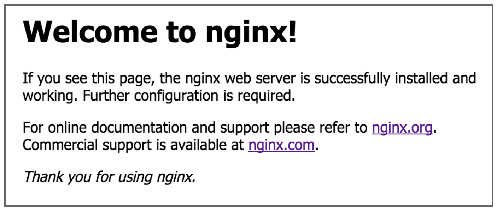

# Install the Application Environment Dependencies

In the previous step, we set up the EC2 environment and connected to our instance running Ubuntu. In this step, we'll install the application environment dependencies on our instance.

We'll need to install the following to begin:

* The AWS CLI

* Node.js and npm

* Git

* NGINX

**Important**

> We must be connected to our instance when running the following commands to install the application environment dependencies. If you are not connected to the instance, run the following command from your terminal, using the public DNS of your instance: `ssh -i "aws-thought.pem" ubuntu@<public DNS of your instance>`. If you are connected successfully, the terminal prompt name should be similar to the following: `ubuntu@ip-123-45-67-890`.

First, we'll add the runtime environment that will execute the application. Run the following command in the Ubuntu CLI to receive root access control:

```console
sudo su -
```

We can see the command prompt changed to `root`. Without assigned root user status, we'd need to prefix the installation commands with `sudo` to run these commands with root user permission. Because the EC2 instance has open access to the internet, we need tightened security around file permissions, especially for code installations.

Update the environment with the following Ubuntu command using the `APT` package:

```console
apt update
```

**Rewind**

> The `apt` command might seem similar to the `npm` command in the Node.js.

## Install the AWS CLI

Next we'll install the AWS CLI on our instance, which is a useful command-line tool that we used previously to connect to the DynamoDB service. We'll use it to store the access keys that the application will use to authenticate access for the S3 and DynamoDB services.

Run the following command in the Ubuntu CLI:

```console
apt install awscli
```

Now we'll set up our AWS CLI profile. To do this, we'll need our access key ID, secret access key, and AWS region we're working in.

**Rewind**

> When we created the admin IAM user in Lesson 1, we should've safely stored the access key ID and secret access key.

Run the following command to configure our AWS CLI:

```console
aws configure
```

When prompted, enter your `AWS Access Key ID` and `AWS Secret Access Key`. Set the default region name as `us-east-2` and assign the default output format as JSON.

**Deep Dive**

For more information on setting up the AWS CLI, check out the [AWS Command Line Interface User Guide](https://docs.aws.amazon.com/cli/latest/userguide/cli-configure-quickstart.html).

## Install Node.js, NPM, and Git

Now we'll install Node.js and npm on our instance by running the following commands in the Ubuntu CLI:

```console
curl -sL https://deb.nodesource.com/setup_10.x | bash -

apt install -y nodejs
```

Run `node --version` to check if the installation was successful.

Next we'll install Git on our instance by running the following command in the Ubuntu CLI:

```console
apt install git-all
```

Run `git --version` to verify that installation was successful.

In the browser, navigate to the GitHub repo for `aws-thought`. Let's clone this repo to our EC2 instance by copying the HTTPS URL or the Secure Shell Protocol (SSH) URL if there is an SSH key linked to the GitHub repo.

Back in our Ubuntu CLI, navigate to `/opt/` by using the command `cd ../opt/` and clone `aws-thought` to our instance. Root folder access to the application will simplify the application's availability to the application server.

Finally, we need to run the following command:

```console
systemctl stop apache2 & rm /var/www/html/index.html
```

Apache2 came with the git-all package and ran upon installation. The above command will stop it from running and delete an overlapping file it has with our next tool: nginx.

## Install NGINX

We also need the `nginx` (pronounced "engine-x") tool to coordinate the application server that will expose our EC2 instance.

To install `nginx`, run the following command in the Ubuntu CLI:

```console
apt install nginx
```

To test the installation, start the `nginx` server by running the following command:

```console
systemctl start nginx
```

To see if the `nginx` server has started, go to the browser and enter the public IPv4 address of the EC2 instance. This can be found in the instance summary for our instance in the EC2 console. The public IPv4 address will direct us to the webpage shown in the following image:



`A screenshot depicts a message that include "Welcome to nginx!"`

---
© 2024 edX Boot Camps LLC. Confidential and Proprietary. All Rights Reserved.