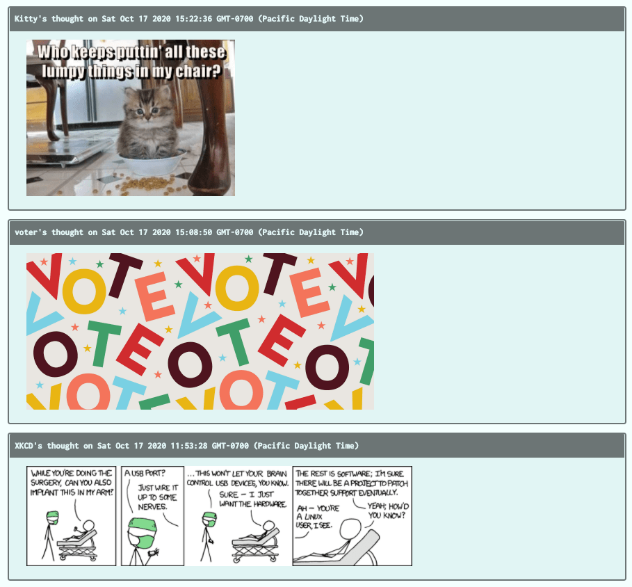

# Build and Run a Production Version of the Application

In the previous step, we modified the API calls. In this step, we'll build and run a production version of the application on our instance.

Navigate to the client directory, then run the following command in the Ubuntu CLI:

```console
npm run build
```

It will take a few minutes to create a compressed version of the React application and place it in the `build` folder of the client.

Once this step has completed, we'll start the React application. We could use the command `npm start`. However, to keep the application running even after we've logged out of the server, we must use a process manager for production Node.js applications, called `pm2`.

**Deep Dive**

To learn more, see the [pm2 documentation](https://pm2.keymetrics.io/docs/usage/pm2-doc-single-page/).

Install the process manager globally by running the following command:

```console
npm install pm2 -g
```

Next we'll use `pm2` to start the React application with the following command, which we'll run from the `aws-thought/client` directory:

```console
pm2 start node_modules/react-scripts/scripts/start.js --name "aws-thought"
```

On a successful start, we'll see a monitor log that resembles the following image:


`A screenshot depicts that the pm2 monitor log displays key data metrics for the React process.`

Now if we enter the Public IPv4 address, we can see the UI of the Deep Thoughts application. Although the data isn't populating, we can see that `pm2` and the `nginx` server are delivering the application to the internet. Next we'll start the back end of the application so that the data from the DynamoDB service can render to the browser. Run the following command from the `aws-thought/server` location:

```console
pm2 start server.js
```

We'll get the following message if the server started successfully:


`A screenshot depicts that the pm2 monitor log displays the server process log.`

Nice work! To check if the API endpoints of the application are working, we could go directly to the resource path in the browser address, or we could simply refresh the homepage in the browser to see if the thoughts are loading from the database and S3 services. This way we can verify that the requests from the client are properly finding the resources from the API endpoints.

If you see the following page, you have successfully completed the deployment of this application to an EC2 instance:



`A screenshot depicts the Deep Thoughts homepage displaying user thoughts and images.`

Test the other two access points on the user profile page and the `ThoughtForm`. Create a new thought and store the image in the S3 bucket to ensure that the permissions are set up properly. Also remember to close this issue in GitHub!

**Pro Tip**

> A configuration file is often used in a project that contains many different interfaces, tables, and elements so a single source of truth can be used to manage them, as shown in the following configuration file. An example of how to use the configuration object can be found in the `server/db/create-bucket.js` file of this project's starter code.

```js
// Config for web services
module.exports = {
  region: 'us-east-2',
  ddb_table: 'Thoughts',
  endpoint: 'http://localhost:8080',
  s3Api: '2006-03-01',
  ddbApi: '2011-12-05',
  ec2Api: '2013-02-01',
  bucket: 'user-images-1602606416801',
};
```

---
© 2024 edX Boot Camps LLC. Confidential and Proprietary. All Rights Reserved.