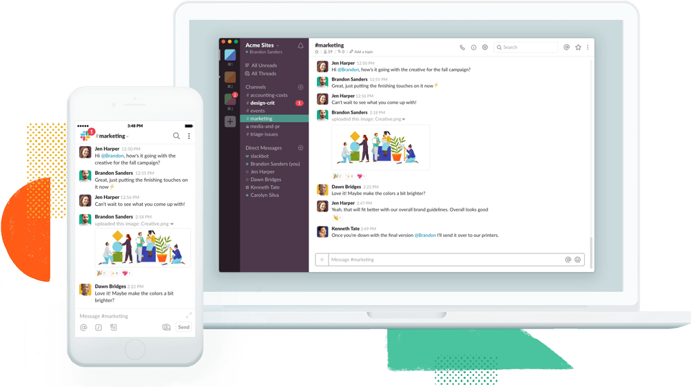

# 1.4.1 Slack and Zoom
You'll use two tools to communicate with your classmates and instructional team throughout the course: Slack and Zoom. You'll learn more about these tools during your Welcome class, when you'll get your first Zoom experience and gain access to your Slack workspace.

## Slack
Slack is the shared, virtual workspace where your class will interact during and outside of class hours. Slack will facilitate regular communication to create a collaborative learning environment, which is essential for this class. In Slack, you can share articles, relevant tips, and study group details. You can even create new forums, known as **channels** in Slack, for study groups.

Slack works on your computer and your phone, as shown in the following image:

For more information about Slack, read the [official Slack guide](https://slack.com/help/categories/360000049043)

### How to Make the Most of Slack
Slack can be a powerful tool for collaboration and learning. Use the following guidelines to get the most out of using it.

Do enable notifications using the Settings gear at the top of each channel:

* Do make sure to download the Slack app for your Desktop rather than using the web app, and also for your mobile phone to ensure you’re kept up to date even when away from your computer.

* Do use the AskBCS bot for getting help outside of class/office hours.

* Do respond in threads. This organizes conversations and makes the Slack workspace much less cluttered.

    * To respond in a thread, point your cursor to a message, then click the chat bubble in the menu that appears to the right:

**NOTE**:
> To the left of the chat bubble is an emoji menu!

* **Do** remember you can create your own channels to share different things with your class by clicking the + sign to the right of the Channels list on Slack. This is a great way to connect with your peers through study groups:

* **Do not** send direct messages to TAs for technical support or post publicly asking for TAs to contact or meet with you. Remember to leverage the Centralized Team of learning assistants via the AskBCS bot on Slack and attend scheduled office hours run by TAs. If you're still struggling, connect with your SSM to talk about tutoring availability.

## Zoom
Your weekly class sessions will be held in the Zoom web conferencing software or live in a classroom near you. With Zoom, you can see and chat with your instructor and classmates, both over video and in a text chatroom. If your class is in person, you will receive explicit intruction on where to go.

Take a moment to watch the following videos to help you get started setting up Zoom and learn more about some of its features:

[How To Use Zoom (How To Set Up Zoom Beginners Guide)](https://www.youtube.com/watch?v=9w3Y_9FLgc4)

### Quick Tips
* Make sure that your microphone is muted when you’re not speaking

* Keep your camera on throughout class to ensure clear communication

* Make sure that you use your preferred full name as your Zoom name

* Your instructor might use polls to gauge how class is going; be sure to participate!

---
© 2024 edX Boot Camps LLC. Confidential and Proprietary. All Rights Reserved.