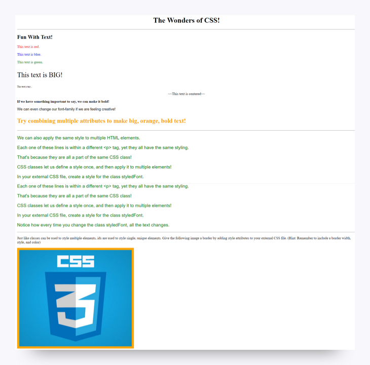

# Style This Page!

## Before You Begin

As we discussed on the previous page, CSS allows us to style HTML webpages with colors, fonts, and much more. It also allows us to define a style once and then use it repeatedly.

## Instructions

1. Create two files in VS Code and save them to your computer. One file should be called `index.html`, and the other should be called `style.css`. These should be in the same folder or directory. You can name this folder something like `css-practice`.

2. Copy (and save) the following code into your HTML file. This is your starting HTML.

```html
<!DOCTYPE html>
<html>
<head>
    <title>CSS Practice</title>
    <!-- Link to your external CSS -->

</head>
<body>

    <!-- Center -->
    <h1>The Wonders of CSS!</h1>

    <hr>

    <h2>Fun With Text!</h2>

    <!-- Change text color -->
    <p>This text is red.</p>
    <p>This text is blue.</p>
    <p>This text is green.</p>

    <!-- Change font-size -->
    <p>This text is BIG!</p>
    <p>This text is tiny...</p>

    <!-- Center -->
    <p>~~This text is centered~~</p>

    <!-- Bold -->
    <p>If we have something important to say, we can make it bold!</p>

    <!-- Change font -->
    <p>We can even change our font-family if we are feeling creative!</p>

    <!-- Multiple attributes -->
    <p>Try combining multiple attributes to make big, orange, bold text!</p>

    <hr>

    <!-- Classes -->
    <p class="styledFont">We can also apply the same style to multiple HTML elements.</p>
    <p class="styledFont">Each one of these lines is within a different &ltp&gt tag, yet they all have the same styling.</p>
    <p class="styledFont">That's because they are all a part of the same CSS class!</p>
    <p class="styledFont">CSS classes let us define a style once and let us then apply it to multiple elements!</p>
    <p class="styledFont">In your external CSS file, create a style for the class styledFont.</p>
    <p class="styledFont">Notice how every time you change the class styledFont, all of the text changes.</p>

    <hr>

    <p>Just as classes can be used to style multiple elements, id's are used to style single, unique elements. Give the following image a border by adding style attributes to your external CSS file. (Hint: Remember to include a border width, style, and color.)</p>

    <!-- Border & id -->
    

    <hr>

</body>
</html>
```

3. Create CSS styles in your `style.css` file so that each of the paragraphs of text are formatted with the appropriate styles. Your finished product should look something like the following image:



4. Upload both your HTML file and your CSS file.

## Helpful Hints

* You might need to modify the HTML for this to work. Think **classes**.

* Look back at the working example on the previous page to figure out how to link HTML and CSS files.

* When in doubt, consult W3Schools resources like this one: [HTML Styles—CSS](http://www.w3schools.com/html/html_css.asp).

## Bonus

Revisit your fan page from the last assignment and add some styles to it using CSS.

## Prework Support

Looking for prework support? Our team of tutors are eager to help! Request a tutor session with the following steps:

1. Click on "Student Support" in the left-hand navigation

2. Fill out the form marked "How can we help?" by entering your name, email, and by selecting "Student"

3. Select "Pre-work Support" from under "Question Category", "Pre-work Assistance" under "Question Sub Category", and enter the issue you're having


---
© 2024 edX Boot Camps LLC. Confidential and Proprietary. All Rights Reserved.