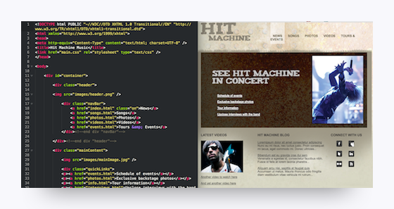

# 2.7.1 What Is a Web Developer?

So you want to learn web development? You've come to the right place! Over the course of the next several weeks, you'll develop and practice the skills needed to become a full-stack web developer. But you might be wondering, "What exactly is a web developer?"

Great question. The title **web developer** is often associated with sketching designs and creating websites, but the day-to-day work of a web developer remains a mystery. Before we can fully answer the question, "What is a web developer?" let's take a few steps back and look at the main piece of the puzzle: the internet.

## How the Internet Works: A Summary

Most of us take it for granted that when we click a link online, something happens. Maybe a chat window appears, maybe a video loads, or maybe we end up on a new page completely.

This happens seamlessly, despite the internet being composed of hundreds of thousands of loosely connected networks of machines and software. In fact, each time you visit a webpage, you're communicating with one of these networks. The network then recognizes your request and, in turn, responds with a viewable webpage.

In the early days, this was the end of the story. Viewable webpages were simple documents composed of a little code describing how they should look and act. Because the pages were static, the transmission was a simple one-way street. See the following screenshot of an old GeoCities page for a great example of a static website:

As time went on, user demands and expectations increased. Users craved websites that felt live, responsive, and richly interactive. As a result, new technologies advanced to allow more complex code to be embedded into a webpage's makeup. Instead of being restricted to sending a static webpage, a network could now send dynamic websites capable of doing much more. For example, the modern website, or **web application**, can do any of the following:

* Display real-time data to users

* Respond to multiple user interface elements simultaneously

* Synchronize visual elements between users across locations

* Livestream videos

* Maintain encrypted channels for private information

* Algorithmically predict user preferences based on historic choices

And much more!

Because of this added complexity, creating these features requires a broad expertise in various technologies and programming methods. As experts in the field, web developers play the essential role of the architects behind users' web experiences.

**So, is web development sort of like graphic design?**

Not really. The tools used to build the web are far from the point in which developers can simply drag and drop visual components onto the screen. Instead, developers use specialized coding languages like HTML, CSS, and JavaScript to lay out their designs and functional features. This is why every browser on the web can view webpages in the same way. Unfortunately, it's also the reason why coding can pose a challenge for beginners.

The following image shows the a website's code on the left and how it appears in a browser on the right:

**Sounds technical. Do I need to have a computer science background?**

Not at all! In fact, according to studies, nearly 50 percent of all professional developers are self-taught. Think about this for a moment. The web development field offers a truly unique breadth and quality of job opportunities, as well as creative freedom. Additionally, unlike most industries, the field is open to those without a formal degree. Learning how to code is a powerful opportunity for those looking to make a career change or reinvent themselves.

**Okay. So if I don't need a degree, how do I prove I'm actually a developer?**

Another great question! If you work hard, remain diligent, and focus on learning, you can build a portfolio of work that demonstrates your expertise.

For many of you, this will be a liberating experience. Your portfolio will become a gateway to your future career, so that employers need not evaluate you based solely on your past credentials and work experience.

For this reason, you'll have homework assignments and projects throughout the program that require you to build web applications. Take these seriously! They may challenge you, but try your best on each assignment. With each assignment, you'll improve your skills and, in turn, build your confidence.

## Recommended Video

* [What Does a Web Developer Do?](https://www.youtube.com/watch?v=GEfuOMzRgXo)

---
© 2024 edX Boot Camps LLC. Confidential and Proprietary. All Rights Reserved.